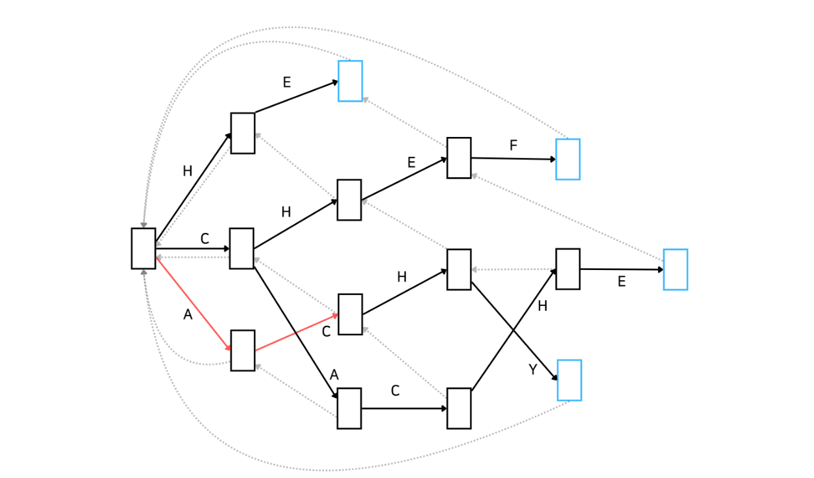
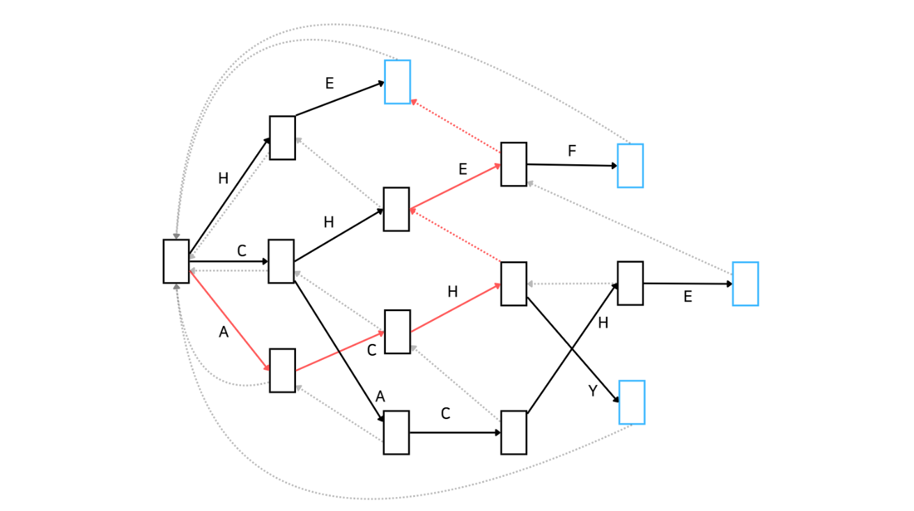

아호코라식 알고리즘은 '문자열 집합에 대해 문자열의 일치 여부를 선형 시간 내에 판단하는 알고리즘'입니다. 
쉽게 말하면 금칙어 집합이 주어졌을 때 문장 속에 금칙어가 포함되어 있는지를 빠른 시간내에 판단하는 알고리즘입니다. 
아호코라식 알고리즘의 시간 복잡도는 O(m + p + n)으로, m은 문자열 집합의 문자열 길이의 합, p는 찾은 문자열의 개수, n은 주어진 문자열의 길이입니다.
길이가 n인 문자열에서 총 p개의 문자열을 찾는다는 의미입니다.

아호코라식 알고리즘은 KMP 알고리즘이 한 단계 발전된 형태의 알고리즘입니다. 
아호코라식 알고리즘에 대해 알아보기 전에 이해를 돕기 위해 KMP 알고리즘을 간단하게 짚고 넘어가보겠습니다.

## KMP 알고리즘 간단 이해
고리타분한 설명보단 예시를 통해 이해해보겠습니다.
KMP 알고리즘은 하나의 문자열에 어떤 하나의 문자열이 포함되어 있는지를 빠른 시간에 판단하는 문자열입니다.
'abaaba'라는 문자열이 포함되어 있는지 판단하고자 하는 상황을 예시로 들겠습니다.
아래와 같이 어떤 문자열에 'abaabc'가 포함되어 있습니다. 
'abaaba'와 매칭이 될 뻔했지만 아쉽게 매칭되지 않았죠.


이런 경우에 'baabc...'부터 다시 탐색하는 게 아니라 다음과 같이 'abc...'부터 다시 탐색하는 알고리즘이 KMP 알고리즘입니다.


이 과정이 가능하려면 탐색에 실패했을 때 다시 탐색할 문자로 연결해주는 '실패 함수' 또는 '실패 링크'가 필요합니다. 
여기서는 실패 함수(Failure Function)라고 하겠습니다. 
'abaaba'의 실패 함수는 다음과 같습니다.


각 의미는 i번째 문자에서 매칭 실패가 발생한다면 F(i) 인덱스부터 다시 탐색하라는 의미입니다.
이해가 잘 안되실텐데 아래 그림을 보겠습니다.
'abac'라는 문자를 매칭 중이며 'abaa'를 매칭하다가 마지막 a에서 매칭에 실패한 상황입니다.
이때  0번째 인덱스인 a가 아니라 1번 인덱스인 b부터 다시 비교하라는 의미입니다. 
즉, 처음부터 다시 비교하는 게 아니라 이미 일치한 부분은 건너 뛰고 비교를 시작하는 것입니다.


KMP 알고리즘을 Automata으로 나타내면 다음과 같습니다. 
점선은 실패함수, 실선은 매칭 성공 시 이동 할 다음 노드를 의미합니다. 
여기서 노드란 '이전까지의 문자열에 대해 매칭에 성공한 상태'를 의미합니다. 
푸른 노드에 다다르면 'abaaba'라는 문자열을 매칭하는 것에 성공한 것을 의미합니다.
###### 참고로 Automata는 ' 추상적인 연산 장치'를 의미합니다. 보통 형식언어를 다룰 때 많이 사용합니다.


## 그림으로 이해하는 아호코라식 알고리즘
KMP 알고리즘은 '문자열 하나'를 찾는 알고리즘인 반면 아호코라식 알고리즘은 '문자열 집합'을 찾는 알고리즘입니다. 
원리는 KMP 알고리즘과 비슷합니다. 
'문자열 매칭을 하다가 매칭에 실패할 경우 실패 함수를 통해 다음에 탐색할 문자의 위치를 찾고 그곳에서부터 다시 탐색한다' 이 개념이 KMP 알고리즘과 아호코라식 알고리즘을 모두 관통하고 있습니다.

이제 본격적으로 아호코라식 알고리즘에 대해 알아봅시다. 
먼저 어떤 방식으로 동작하는지 Automata를 통해 간단하게 알아보고 코드를 보며 더 자세히 알아보겠습니다. 
아래 그림은 문자열 집합 {'HE', 'CHEF', 'CACHE', ACHY'}에 속하는 문자열을 포함하는지 확인하는 아호코라식 알고리즘을 Automata로 나타낸 것입니다.


이러한 자료구조를 Trie라고도 합니다. 
문자열을 효율적으로 저장하고 탐색하기 위한 트리 형태의 자료구조이죠. 
복잡해 보이지만 KMP를 간단하게 훑고 오니까 어떤 흐름인지는 아시겠죠? 좋습니다. 
이해를 조금 더 돕기 위해 예시를 하나 들어보겠습니다.

'BACHEC'라는 문자열이 입력으로 주어졌습니다. 
먼저 root 노드에서 문자 'B'를 매칭할 수 있는지 살펴봅시다. 
root에서는 'H', 'C', 'A'만 매칭할 수 있기 때문에 넘어갑니다. 
다음 문자인 'A'는 root 노드에서 매칭될 수 있습니다. 
아래와 같이 'A'가 매칭된 상태로 넘어갑니다.


다음으로는 문자 'C'가 기다리고 있습니다.
Automata를 잘 살펴보니 'A'가 매칭된 이후에 다시 'C'가 매칭될 수 있습니다. 
이제 'AC'가 매칭된 상태로 넘어갑니다.



마찬가지로 다음 문자 'H'도 매칭될 수 있습니다. 
따라서 'ACH'가 매칭된 상태로 넘어갑니다.


그 다음으로는 'E'가 매칭되어야 하는데, Automata 상으로 'ACH' 다음으로 'E'는 매칭될 수 없습니다. 
따라서 실패함수가 가리키는 상태로 이동합니다.


실패 함수를 따라 이동한 상태는 'CH'가 매칭된 상태입니다. 해당 상태에서 'E'가 매칭될 수 있습니다.
따라서 'CHE'가 매칭된 상태로 이동합니다. 
만약 여기서 E가 매칭될 수 없다면 다시 실패함수를 따라 이동합니다. 
그러면 'H'만 매칭된 상태로 이동하겠네요. 
하지만 우리는 'CH'가 매칭된 상태에서 'E'가 매칭될 수 있으므로 다음과 같이 이동합니다.


마지막으로 'C'가 매칭되는지 봅시다. 
보시다시피 'CHE' 상태에서 'C'는 매칭될 수 없습니다. 
따라서 실패함수를 통해 이동합니다.



이동한 상태는 'HE'가 매칭된 상태입니다. 
그리고 푸른 노드(상태)에 도착했습니다. 
푸른 노드는 문자열 집합에 속하는 문자열과 매칭이 되었다는 것을 의미합니다. 
따라서 우리는 'BACHEC'라는 문자열에는 'HE'만 매칭됨을 알 수 있습니다!

어떤가요? 
KMP 알고리즘과 유사하지만 한 단계 더 발전한 알고리즘이라는 걸 느낄 수 있습니다. 
여기서 궁금한 점이 생겼을 수도 있겠는데요, **만약 주어진 문자열이 'BACHEF'라면, 즉 마지막 문자가 'C'가 아닌 'F'였다면 'CHEF'가 매칭되는 것은 성공할텐데 과연 'HE'도 매칭될 수 있을까요?** 
두 개 모두 매칭되어야 하는 게 정상적이겠지만 이러한 흐름이라면 'HE'는 매칭될 수 없습니다. 
어떻게 해결할 수 있는지 궁금하죠!? 
이 문제를 해결하는 방법은 '아호코라식 알고리즘 완벽 정리 심화'편으로 작성해보겠습니다.

어쨌든 이런 궁금증은 일단 뒤로 미루어 놓고, 이제는 아호코라식 알고리즘을 코드로  어떻게 구현하는지 알아보겠습니다.

## 아호코라식 알고리즘 코드로 이해하기

코드를 설명하기 전에 우선 제가 보여드릴 코드는 아래 블로그 글에 게시된 코드를 참고하여 주석만 수정했다는 점을 먼저 말씀드리겠습니다.

https://loosie.tistory.com/588

우선 코드의 전문을 보여드리겠습니다. 
한 번 읽어보시고 설명을 따라오셔도 되고, 그냥 건너뛰고 설명을 먼저 보셔도 됩니다.

```java
import java.io.*;
import java.util.*;

public class Main {

	static final int SIZE = 26; // a ~ z
	static class TrieNode{
		boolean output; // 현재 노드에서 pattern 하나가 끝나는지 여부(푸른 노드이면 true)
		Map<Character, TrieNode> child = new HashMap<>(); // 자식 노드들
		TrieNode fail; // 매칭 실패 시 이동할 노드(= 실패 함수)
		public TrieNode() {}
		
		// pattern(ex. 금칙어) 추가하기 - 알고리즘의 전처리 과정
		public void insert(String word) { 
			TrieNode curNode = this; // 현재 노드(초기 값은 this(= root))
			for(int i=0; i<word.length(); i++) {
				char c = word.charAt(i);
				
				curNode.child.putIfAbsent(c, new TrieNode()); // 자식 노드 중 문자 c가 없다면 노드 추가
				curNode = curNode.child.get(c); // 문자 c 노드로 이동 
				
				if(i== word.length() - 1) { // 마지막 문자라면 현재 노드의 output을 true로 설정(푸른 노드로 설정)
					curNode.output = true;
				}
			}
		}
		
		// 실패 함수 설정(실패 시 이동할 노드 설정) - bfs로 수행
		public void computeFailFunc() {
			Queue<TrieNode> q = new LinkedList<>(); // bfs queue
			this.fail = this; // root의 실패 노드를 root로 초기화
			q.add(this);
			
			while (!q.isEmpty()) { // bfs 수행
				TrieNode cur = q.poll();
				for (int i=0; i<SIZE; i++) {
					char c = (char)(i+97);
					
					TrieNode nxt = cur.child.get(c); // 문자 c인 자식 get
					if (nxt ==null) continue; // 그런 자식이 없는 경우 건너뜀
					
					if (cur == this) { // poll한 노드가 root인 경우, 즉 root의 nxt가 직속 자식인 경우 실패함수는 root로 설정
						nxt.fail = this;
					} else {
						TrieNode failLinkNode = cur.fail;
						
						// 실패 링크를 따라가며 자식 노드 중 c를 가진 노드 찾기
						while (failLinkNode != this && failLinkNode.child.get(c) == null) {
							failLinkNode = failLinkNode.fail;
						}
						
						// while문에서 해당 노드를 찾았다면
						// 실패 링크를 해당 노드의 자식 노드 중 c인 노드로 설정
						if (failLinkNode.child.get(c) != null) {
							failLinkNode = failLinkNode.child.get(c);
						}
						nxt.fail = failLinkNode;
					}
					
					// 실패 링크가 output == true인 경우 불필요한 탐색을 막기 위해 현재 노드도 output == true로 설정
					if (nxt.fail.output) {
						nxt.output =true;
					}
					q.add(nxt);
				}
			}
		}
		
		// 아호코라식
		public boolean ahoCorasick(String word) {
			TrieNode curNode = this;
			for(int i=0; i<word.length(); i++) {
				char c = word.charAt(i);
				// root 노드가 아니면서 매칭이 안되는 경우 실패 함수가 가리키는 노드로 이동
				// 최악의 경우 root 노드로 이동할 수 있음
				while(curNode != this && curNode.child.get(c) == null) {
					curNode = curNode.fail;
				}
				
				// 매칭이 가능하다면 이동
				if(curNode.child.get(c)!=null) {
					curNode = curNode.child.get(c);
				}
				
				// 금칙어의 유무만 판단
				if(curNode.output) {
					return true;
				}
			}
			return false;
			
		}
	}
	
	public static void main(String[] args) throws IOException{
		BufferedReader br = new BufferedReader(new InputStreamReader(System.in));
		int n = Integer.parseInt(br.readLine());
		
		TrieNode trieSet = new TrieNode();
		for(int i=0; i<n; i++) {
			trieSet.insert(br.readLine());
		}
		
		trieSet.computeFailFunc();
		
		StringBuilder sb = new StringBuilder();
		int q = Integer.parseInt(br.readLine());
		for(int i=0; i<q; i++) {
			if(trieSet.ahoCorasick(br.readLine())) {
				sb.append("YES\n");
			}else {
				sb.append("NO\n");
			}
		}
		System.out.println(sb.toString());
	}
}
```

코드를 위에서부터 하나하나 살펴보겠습니다.

### ASCII 상수
```java
static final int SIZE = 26; // a ~ z
```

a ~ z의 문자만 매칭하겠다는 의미로 SIZE라는 상수를 선언해 두었습니다.

### TrieNode의 멤버 변수
```java
static class TrieNode{
    boolean output; // 현재 노드에서 pattern 하나가 끝나는지 여부(푸른 노드이면 true)
    Map<Character, TrieNode> child = new HashMap<>(); // 자식 노드들
    TrieNode fail; // 매칭 실패 시 이동할 노드(= 실패 함수)
```

- output: 현재 노드(상태)가 매칭이 완료된 상태인지의 유무를 나타냅니다. 위 Automata에서 '푸른 노드'인 경우 true임을 의미합니다.
- child: 현재 노드와 연결된 자식 노드를 의미합니다. Map 자료구조가 사용되었으며 Automata에서 실선 화살표에 문자가 있었듯이 여기서도 문자를 key로 두고 노드를 찾습니다. 어떤 노드(상태)와 연결된 '실선'을 구현해 놓은 변수라고 보시면 되겠습니다.
- fail: 현재 노드의 실패 함수입니다. 실패 시 이동할 노드를 의미합니다.

### insert 메서드
```java
public void insert(String word) { 
    TrieNode curNode = this; // 현재 노드(초기 값은 this(= root))
    for(int i=0; i<word.length(); i++) {
        char c = word.charAt(i);

        curNode.child.putIfAbsent(c, new TrieNode()); // 자식 노드 중 문자 c가 없다면 노드 추가
        curNode = curNode.child.get(c); // 문자 c 노드로 이동 

        if(i== word.length() - 1) { // 마지막 문자라면 현재 노드의 output을 true로 설정(푸른 노드로 설정)
            curNode.output = true;
        }
    }
}
```

위에서 Trie라는 자료구조를 설명드렸는데 기억이 나실까요? 
Automata라고 막 떠들어댔던 그 그림이 Trie 자료구조입니다. 
insert 메서드는 Trie 자료구조를 구축하는 메서드입니다.

차근차근 보겠습니다. 
먼저 curNode라는 변수에 this라는 값을 넣습니다. 
여기서 this는 root 노드를 의미합니다. 
즉 일단 현재 노드는 root 노드라는 의미입니다.

그리고 for문을 돌면서 파라미터로 받은 문자열의 문자들을 하나씩 순회합니다. 
순회하는 문자를 c라고 하겠습니다. 
현재 노드에서 c가 매칭될 수 없다면 현재 노드에 c가 매칭될 수 있는 노드를 추가하고 추가된 노드로 이동하고, 현재 노드에서 c가 매칭될 수 있다면 노드를 새로 추가하지 않고 c가 매칭될 수 있는 노드로 이동합니다. 
아래가 이 설명에 해당하는 코드입니다.

```java
curNode.child.putIfAbsent(c, new TrieNode()); // 자식 노드 중 문자 c가 없다면 노드 추가
curNode = curNode.child.get(c); // 문자 c 노드로 이동
```

그리고 마지막으로, 현재 노드가 마지막 문자를 위한 노드라면 현재 노드의 output을 true로 설정합니다. 
푸른 노드를 만드는 것이죠. 
아래가 해당 코드입니다.

```java
if(i== word.length() - 1) { // 마지막 문자라면 현재 노드의 output을 true로 설정(푸른 노드로 설정)
    curNode.output = true;
}
```

### computeFailFunc 메서드
실패 함수를 설정하는 메서드입니다. 
이해하기 어려우실 수도 있는데 아호코라식 알고리즘의 핵심 중에 핵심이기 때문에 꼭 이해하고 넘어가시면 좋을 것 같습니다. 
마찬가지로 차근차근 알아보겠습니다.

```java
public void computeFailFunc() {
    Queue<TrieNode> q = new LinkedList<>(); // bfs queue
    this.fail = this; // root의 실패 노드를 root로 초기화
    q.add(this);

    while (!q.isEmpty()) { // bfs 수행
        TrieNode cur = q.poll();
        for (int i=0; i<SIZE; i++) {
            char c = (char)(i+97);

            TrieNode nxt = cur.child.get(c); // 문자 c인 자식 get
            if (nxt ==null) continue; // 그런 자식이 없는 경우 건너뜀

            if (cur == this) { // poll한 노드가 root인 경우, 즉 root의 nxt가 직속 자식인 경우 실패함수는 root로 설정
                nxt.fail = this;
            } else {
                TrieNode failLinkNode = cur.fail;

                // 실패 링크를 따라가며 자식 노드 중 c를 가진 노드 찾기
                while (failLinkNode != this && failLinkNode.child.get(c) == null) {
                    failLinkNode = failLinkNode.fail;
                }

                // while문에서 해당 노드를 찾았다면
                // 실패 링크를 해당 노드의 자식 노드 중 c인 노드로 설정
                if (failLinkNode.child.get(c) != null) {
                    failLinkNode = failLinkNode.child.get(c);
                }
                nxt.fail = failLinkNode;
            }

            // 실패 링크가 output == true인 경우 불필요한 탐색을 막기 위해 현재 노드도 output == true로 설정
            if (nxt.fail.output) {
                nxt.output =true;
            }
            q.add(nxt);
        }
    }
}
```

#### bfs로 탐색
실패 함수를 설정하는 방법은 bfs로 노드를 하나씩 탐색해가며 설정하는 방식입니다. 
그래서 아래와 같이 bfs에 필요한 queue를 생성하고 탐색을 시작합니다. 
참고로 여기서 this는 root 노드를 의미합니다.

```java
public void computeFailFunc() {
    Queue<TrieNode> q = new LinkedList<>(); // bfs queue
    this.fail = this; // root의 실패 노드를 root로 초기화
    q.add(this);
    while (!q.isEmpty()) { // bfs 수행
    	TrieNode cur = q.poll();
```

#### 실패 함수 설정
먼저 코드부터 보시겠습니다. 
아래에 작성한 설명들을 잘 이해할 수 있도록 필요한 곳에 번호를 붙여 놓았으니 참고해주시기 바랍니다.

```java
while (!q.isEmpty()) { // bfs 수행
    TrieNode cur = q.poll();
    for (int i=0; i<SIZE; i++) {
        // 1 시작 ========================================================
        char c = (char)(i+97);
        // 1 끝 ==========================================================

        // 2 시작 ========================================================
        TrieNode nxt = cur.child.get(c); // 문자 c인 자식 get
        if (nxt ==null) continue; // 그런 자식이 없는 경우 건너뜀
        // 2 끝 ==========================================================

        // 3 시작 ========================================================
        if (cur == this) { // poll한 노드가 root인 경우, 즉 root의 nxt가 직속 자식인 경우 실패함수는 root로 설정
            nxt.fail = this;
        // 3 끝 ==========================================================
        } else {
            // 4 시작 ====================================================
            TrieNode failLinkNode = cur.fail;

            // 실패 링크를 따라가며 자식 노드 중 c를 가진 노드 찾기
            while (failLinkNode != this && failLinkNode.child.get(c) == null) {
                failLinkNode = failLinkNode.fail;
            }
            // 4 끝 ======================================================

            // 5 시작 ====================================================
            // while문에서 해당 노드를 찾았다면
            // 실패 링크를 해당 노드의 자식 노드 중 c인 노드로 설정
            if (failLinkNode.child.get(c) != null) {
                failLinkNode = failLinkNode.child.get(c);
            }
            nxt.fail = failLinkNode;
            // 5 끝 ======================================================
        }

        // 6 시작 ========================================================
        // 실패 링크가 output == true인 경우 불필요한 탐색을 막기 위해 현재 노드도 output == true로 설정
        if (nxt.fail.output) {
            nxt.output =true;
        }
        // 6 끝 ==========================================================
        
        // 7 시작 ========================================================
        q.add(nxt);
        // 7 끝 ==========================================================
    }
}
```

번호 순서대로 설명을 드리겠습니다.
#### 1
보통 bfs를 할 때 현재 노드에 연결된 노드들을 모두 확인하는 작업을 거치듯이 여기서는 현재 노드에 연결된 모든 노드를 확인하기 위해서 'a' ~ 'z'로 연결된 노드가 있는지 모두 확인하는 작업을 거칩니다. 
여기서 c는 'a' ~ 'z' 중 하나의 문자입니다.

#### 2
nxt는 현재 노드(cur)와 문자 c로 연결된 자식 노드를 의미합니다.
nxt가 null이라는 의미는 문자 c로 연결된 자식 노드가 없다는 것을 의미하죠. 
그런 경우 바로 다음 문자를 탐색하는 과정으로 넘어갑니다. 
아래 그림으로 간단하게 살펴보자면, 현재 노드(cur)가 root라고 쳐보겠습니다. 
'a' ~ 'z'까지 순차적으로 탐색하는데(그림은 대문자로 되어 있는데 소문자라고 생각해 주십쇼 ㅎㅎ) root에는 'a'와 연결된 자식 노드가 있습니다. 
이 경우 continue하지 않고 아직 설명드리지 않은 3 ~ 6로직을 수행하면서 해당 노드(root의 자식 노드)의 실패 함수를 설정합니다. 
그 다음으로 'b'와 연결된 자식 노드를 찾을텐데 그런 노드는 없습니다. 
이런 경우에는 continue하면서 바로 다음 문자인 'c'를 탐색합니다. 


#### 3
cur == this인 경우, 즉 현재 노드가 root 노드인 경우 nxt, 즉 자식 노드의 실패 함수를 root 노드로 합니다. 
간단히 말해서 root와 직접 연결된 노드들의 실패 함수는 root를 향한다는 의미입니다. 
어떻게 보면 자명한 사실인 것 같네요.

#### 4
root의 자식이 아닌 노드들의 실패 함수를 설정하는 코드입니다.
최대한 이해하기 쉽게 설명드려 볼게요.
먼저 현재 노드의 실패 함수를 failLinkNode에 저장합니다. 
엄밀히 말하면 '실패 함수가 가리키는 노드'인데 간단하게 실패 함수라고 하겠습니다. 
여기서 cur은 root가 아닙니다. cur이 root인 경우는 3번에서 이미 처리했기 때문이죠.

이제 아래 그림을 보시겠습니다. 
cur와 nxt가 명시되어 있습니다. 
cur은 'CH'와 매칭이 된 상태, nxt는 'CHE'와 매칭이 된 상태입니다. 
목표는 nxt의 실패 함수를 설정하는 것입니다. 
어떻게 해야 할까요?


우선 'CHE'가 매칭된 상태의 실패함수가 어떤 역할인지 생각해 보겠습니다. 
간단합니다. 'CHE'까지는 매칭이 되었지만 다음 문자가 'F가 아닐 때 다시 탐색해야 하는 위치를 의미합니다.
예를 들어 주어진 문자열이 'CHEA'라고 해봅시다. 
'CHE'까지는 매칭이 됐지만 'A'가 매칭되지 않아서 다시 탐색해야 하죠. 
이 상황에서 어디서부터 탐색해야 할까요?

바로 'HE'부터 다시 탐색해야 합니다.
그러기 위해선 cur의 실패함수를 통해 이동한 노드의 자식 중에서 'E'로 연결된 자식 노드로 이동해야 합니다.
말이 어렵죠? 쉽게 말하면 'HE'가 매칭된 상태를 찾아서 이동한다는 의미입니다. 
해당 이동 경로는 cur의 실패함수가 알고 있습니다. 
만약 'HE'가 매칭된 상태가 없다면 cur의 실패함수로 이동한 노드에서 '다시 한 번 더' 실패함수를 통해 이동해서 같은 과정을 반복합니다. 
최종 목적은 매칭된 문자열이 'E'로 끝나는 상태로 이동하는 것입니다. 
이 과정은 실패 함수로 root 도달하거나 'E'로 끝나는 상태를 찾은 경우 멈춥니다.

만약 Automata가 위와 다르게 아래와 같은 모양이라면 실패 함수를 통해 root까지 이동하여 'E'가 매칭된 상태를 찾게 되겠네요.


이 경우에 실패 함수는 다음과 같이 형성됩니다.


어떤가요? 실패함수가 형성되는 과정을 이해하는 데에 도움이 되셨나요?
정리해보면, **cur의 실패함수를 따라가면서 만난 노드들의 자식 노드를 살펴보면서 'E'로 연결된 자식 노드가 있다면 해당 자식 노드로 실패 함수를 연결하는 과정을 반복하는 것입니다.**

#### 5
5번 코드는 실패 함수로 찾은 노드의 자식 노드 중에서 문자 c로 연결된 자식 노드가 있다면 해당 노드로 nxt의 실패 함수를 생성하고 그러한 자식 노드가 없는 경우에는 실패 함수로 찾은 노드 자체로 실패 함수를 생성하는 코드입니다. 
한마디로 실제로 실패 함수를 생성하는 코드입니다.

#### 6
6번 코드는 탐색 시간을 줄여주는 역할을 합니다.
실패 함수가 가리키는 노드가 output == true일 때 현재 노드의 output도 true로 설정함으로써 굳이 실패 함수로 이동하지 않아도 매칭이 완료됐음을 알 수 있게 하는 것이죠. 
푸른 노드가 몇 개 더 만들어 지는 것과 같은 의미입니다.
아래 그림을 보면 'CHE'가 매칭 완료된 상태는 'HE'가 매칭 완료된 것과 같은 상태이기 때문에 푸른 노드로 설정됩니다.


단, 이 방법은 '매칭의 유무'만 판단하기 때문에 어떤 문자열이 매칭되었는지는 알 수 없습니다. 
주어진 문자열에 { 'HE', 'CHEF', 'CACHE', 'ACHY' } 중 포함된 문자가 있는지 확인만 하고 어떤 문자열이 포함되었는지는 알 수 없죠.

#### 7
마지막으로 nxt 노드를 queue에 집어 넣습니다. bfs의 탐색 방식을 떠올리시면 됩니다.

### ahoCorasick 메서드

실제로 매칭을 수행하는 메서드입니다.
먼저 전체 코드입니다. 
파라미터로 검증하고자 하는 문자열을 받습니다. 

```java
public boolean ahoCorasick(String word) {
    TrieNode curNode = this;
    for(int i=0; i<word.length(); i++) {
        char c = word.charAt(i);
        // root 노드가 아니면서 매칭이 안되는 경우 실패 함수가 가리키는 노드로 이동
        // 최악의 경우 root 노드로 이동할 수 있음
        while(curNode != this && curNode.child.get(c) == null) {
            curNode = curNode.fail;
        }

        // 매칭이 가능하다면 이동
        if(curNode.child.get(c)!=null) {
            curNode = curNode.child.get(c);
        }

        // 금칙어의 유무만 판단
        if(curNode.output) {
            return true;
        }
    }
    
    return false;
}
```

하나하나 보겠습니다. 
먼저 파라미터로 받은 문자열의 문자를 하나씩 순회하며 그 문자를 c에 저장합니다. 
현재 root 노드가 아닌데 매칭에 실패하는 경우 실패 함수를 타고 이동합니다. 
c가 매칭이 되거나 root 노드에 도달할 때까지 이를 반복합니다.

```java
char c = word.charAt(i);
// root 노드가 아니면서 매칭이 안되는 경우 실패 함수가 가리키는 노드로 이동
// 최악의 경우 root 노드로 이동할 수 있음
while(curNode != this && curNode.child.get(c) == null) {
    curNode = curNode.fail;
}
```

이전 반복을 통해 도달한 curNode에서 매칭이 가능하다면 해당 노드로 이동합니다. 
그 후에 문자열이 매칭되었는지 판단합니다. 
만약 매칭 되었다면 true를 리턴하면서 ahoCorasick 메서드를 빠져나갑니다. 

```java
// 매칭이 가능하다면 이동
if(curNode.child.get(c)!=null) {
    curNode = curNode.child.get(c);
}

// 금칙어의 유무만 판단
if(curNode.output) {
    return true;
}
```

만약 모든 경우에 대해서 매칭에 실패한다면 false를 반환합니다.

```java
return false;
```

## 마무리 하며
이 글이 아호코라식 알고리즘을 이해하는 데에 도움이 되셨는지 모르겠습니다. 
제가 이해한 내용을 나름대로 풀어서 설명을 한 건데 부족한 점이 많은 것 같습니다. 
아호코라식 알고리즘은 유사 검색어 찾기, 금칙어 탐색 등 여러 문자열을 찾아야 하는 경우에 자주 사용됩니다. 
이번 글에서 소개한 내용은 찾은 문자열을 알 순 없는 구조이긴 합니다만(추후에 심화 버전으로 글을 하나 더 작성하겠습니다) 
그래도 한 번 이해하시면 도움이 될 때가 분명히 있으리라 생각합니다.

그런 의미에서 관련된 알고리즘 문제 몇 개를 가져왔는데 아호코라식 알고리즘을 제대로 이해했는지 한 번 풀어 보시죠!

긴 글 읽어주셔서 감사합니다.