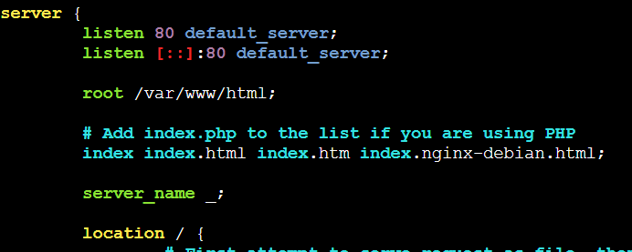
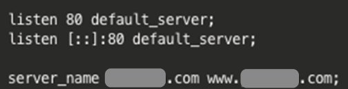

---
### 도메인 구매
먼저, nginx를 통해 ssl 인증서를 발급받기 위해서는 도메인이 필요하다.
여러 사이트에서 도메인을 판매하고 있으니, 저렴하거나 자신의 서비스 이름을 포함한 도메인을 미리 구매하도록 하자!

<br>

### Nginx 다운로드
도메인이 준비되었다면 이제 EC2 콘솔로 들어가 다음 명령어를 통해 nginx를 다운로드 받는다.
```
$ apt-get update
sudo apt install nginx
```

<br>

### Nginx 기본 설정 파일 생성 - 중요❗
nginx 설치 후에 nginx 기본 설정 파일을 생성하도록 한다.
```
$ sudo vi /etc/nginx/sites-available/default
```
위의 명령어를 실행하게 되면 콘솔창에서는 vi 편집기 화면과 기본 설정이 담겨있는 파일이 열린다.
여기서`i` 키를 누르면 파일편집이 가능하며, 편집 완료 후에는 `ESC `+ ` :wq`을 통해 저장이 가능하다.

nginx의 설정파일안에는 무수히 많은 내용들이 들어있지만 SSL 인증서발급을 위한 리버스 프록시 부분은 여기만 확인하면 된다.


여기서 아래 보이는 server_name 옆에 내가 https를 구축하고 싶은 도메인을 작성하고 저장한다.
```
server_name 무너라면.com www.무너라면.com
```

우리팀도 아래와 같이 작성해주었다!



### Nginx 재시작
이제 도메인을 작성해주었으니 nginx를 재시작한다.
```
$ sudo service nginx restart #nginx 재시작
```

<br>

### Let's Encrypt 클라이언트 다운로드
본격적으로 ssl 인증서를 발급받아보자!
우리는 Let's Encrypt를 통해 ssl인증서를 발급받을 것이기 때문에
해당 클라이언트를 먼저 다운로드 한다.
여기서 버전이 `python` 에서 `python3`으로 변경되었으니 꼭 뒤에 숫자 붙이는 것을 놓치지 않기!
```
$ sudo apt-get install certbot
$ apt-get install python3-certbot-nginx
```
<br>

### SSL 인증서 취득
이제 SSL 인증서를 발급받으면 된다.
옆에는 내가 nginx 설정 파일에 작성했던 도메인을 -d 옆에 적어주도록 하자.
```
$ sudo certbot --nginx -d 무너라면.com -d www.무너라면.com
```
<br>

### Nginx 재시작
여기까지 인증서 발급이 모두 완료되었다! 마지막으로 nginx를 재시작 해주자

---

이제 기존에 접속했던 주소가 아닌 해당 도메인으로 접속하면 https가 떠있는 모습을 확인할 수 있다.
초기 배포시에 빠르게 ssl 인증서 를 발급받아 클라이언트와 원활한 API 연동을 하도록 해보자!
